# Solar Dashboard User Manual

Solar Dashboard is an Android app that monitors your off-grid power system over
Bluetooth: JBD/Vatrer battery packs (BMS) and Victron solar chargers, inverters,
and monitors. It runs on your phone and stores all data on your phone. Nothing
is sent anywhere except the low-battery alerts you configure.

This manual covers installation, first-time setup, reading the dashboard, every
setting, and troubleshooting.

## Contents

1. [Requirements](#1-requirements)
2. [Installing the app](#2-installing-the-app)
3. [First run and permissions](#3-first-run-and-permissions)
4. [Adding your devices](#4-adding-your-devices)
5. [Finding a Victron advertisement key](#5-finding-a-victron-advertisement-key)
6. [Reading the dashboard](#6-reading-the-dashboard)
7. [Device cards](#7-device-cards)
8. [History charts](#8-history-charts)
9. [Settings](#9-settings)
10. [Low-battery alerts](#10-low-battery-alerts)
11. [Database maintenance](#11-database-maintenance)
12. [Help screen](#12-help-screen)
13. [Troubleshooting](#13-troubleshooting)
14. [Privacy and data](#14-privacy-and-data)

---

## 1. Requirements

- An Android phone running Android 8.0 (API 26) or newer.
- Bluetooth (the phone does the scanning and connecting).
- Your devices' Bluetooth MAC addresses. The in-app scanner fills these in for you.
- For Victron devices, the 32-character **advertisement key** from VictronConnect
  (see [section 5](#5-finding-a-victron-advertisement-key)).
- For SMS alerts (optional), a SIM with cell service.
- For email alerts (optional), a Gmail account with an App Password.

## 2. Installing the app

The app is distributed as a sideloadable APK (`app-debug.apk`).

1. Copy the APK to your phone (USB, cloud storage, or a direct download).
2. On the phone, allow "install unknown apps" for the app you are using to open
   the file (your browser or file manager).
3. Tap the APK and confirm the install.

Or, with the Android platform tools on a computer connected to the phone:

```
adb install app-debug.apk
```

## 3. First run and permissions

On first launch the app shows a welcome screen explaining what it does and what
you will need. Tap **Get started** to open Settings and add your first device.

When prompted, grant the requested permissions:

- **Bluetooth** (scan and connect). Required to read any device.
- **Notifications**. Used for the ongoing status notification and low-battery alerts.
- On Android 11 and older, **Location** is required by the system for Bluetooth scanning.

If you skip a permission the app still runs, but devices that need it will report
errors until it is granted.

The monitor runs as a background service and restarts itself after a phone reboot
or an app update, as long as you have at least one device configured, so you do
not have to reopen the app to keep monitoring. (After a reboot, unlock the phone
once so Android delivers the startup signal.)

### Keep it running with the screen off

Android can pause background work, including Bluetooth polling and alerts, when
the phone is idle with the screen off. If the dashboard shows a
**"Battery optimization is on"** banner, tap it and choose to stop optimizing
battery usage for Solar Dashboard. This is the single most important setting for
reliable unattended monitoring and overnight alerts. For a phone dedicated to
monitoring, keep it plugged in.

## 4. Adding your devices

Open **Settings** with the gear icon in the top right. Settings is organized into
collapsible sections; tap a section header to expand or collapse it. On arrival
only **Devices** is open.

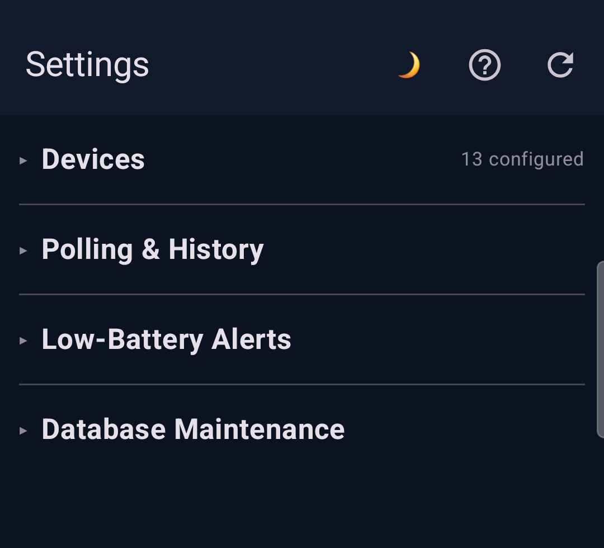

Open the **Devices** section and tap **Add BMS** for a battery pack or
**Add Victron** for a solar charger, inverter, or monitor.

In the editor, tap **Scan for nearby devices**. The app lists devices in range by
name and MAC address, and hides any you have already added. Tap the one you want
to fill in its MAC automatically.

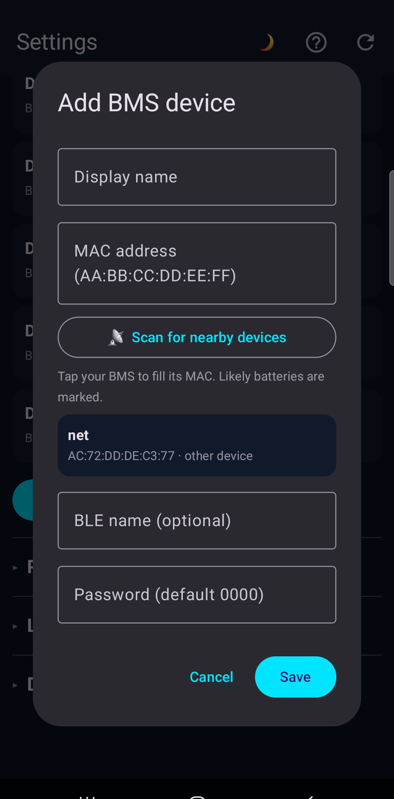

- For a **BMS**, likely batteries are marked "likely battery"; other Bluetooth
  devices nearby are marked "other device". Set a **Password** only if your pack
  needs one (the default is `0000`).
- For a **Victron** device, paste its **advertisement key** (next section) and
  confirm the **Type** (mppt, inverter, monitor, dcdc). The scan suggests a type.

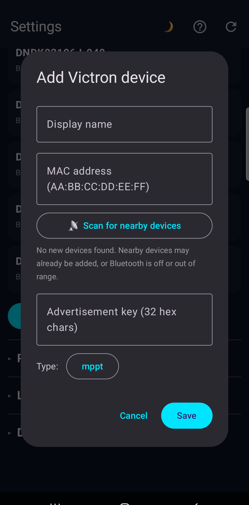

Tap **Save**. Within one poll cycle the device appears on the dashboard.

Your configured devices are listed in the Devices section, each with an **Edit**
and a delete button.

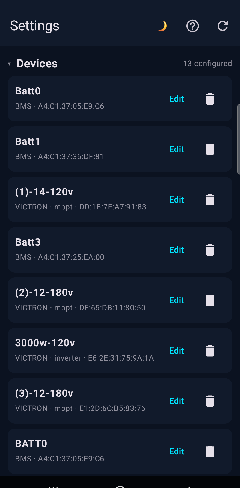

## 5. Finding a Victron advertisement key

The MAC address is broadcast over the air, but the encryption key is not, so you
enter it once per Victron device.

In the **VictronConnect** app:

1. Open the device.
2. Tap the gear icon (settings).
3. Open **Product info**.
4. Find **Instant readout via Bluetooth** and tap **Show**.
5. Copy the 32-character **advertisement key**.

Paste it into the app's key field. The app accepts extra spaces or a leading MAC
prefix, so a copy that includes the MAC still works. Use the advertisement key,
not the Encryption key.

## 6. Reading the dashboard

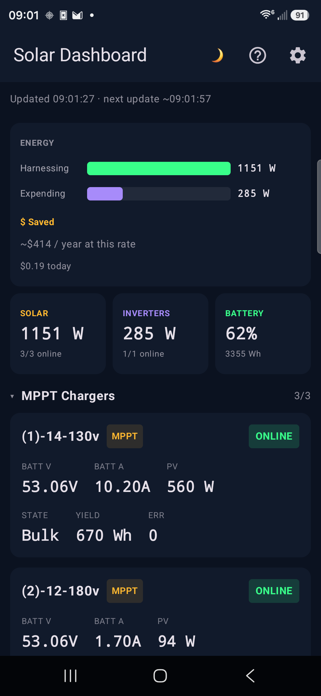

From top to bottom:

- **Top bar.** The moon/sun/briefcase icon cycles the theme (dark, light,
  business). The question mark opens Help. The gear opens Settings.
- **Update line.** Shows when the last reading arrived and the approximate time of
  the next poll, for example `Updated 15:03:17 · next update ~15:03:47`.
- **Energy card.**
  - **Harnessing**: total solar power being produced right now (watts).
  - **Expending**: total power your inverters are delivering to loads right now.
  - **$ Saved**: the value of the energy your loads used so far today, priced at
    the electricity rate you set in Settings (default is the national average).
    It is based on load energy, not solar harvested, so it keeps climbing at
    night while the battery runs your loads, and it resets at midnight. It is an
    estimate.
- **Summary tiles.** SOLAR (total PV watts), INVERTERS (total AC output), and
  BATTERY (average state of charge), each with an online count.
- **Device sections.** MPPT Chargers, Inverters, Battery Packs, and Other Devices.
  Tap a section header to collapse or expand it; the number on the right is how
  many devices in that section are online.

## 7. Device cards

Each device has a status badge: **ONLINE** (fresh data this cycle), **PARTIAL**
(some data plus a warning), or **OFFLINE** (not reachable this cycle).

**Solar charger (MPPT):** battery volts and amps, PV watts, charger state (Bulk,
Absorption, Float), yield for the day, and any error code.

**Inverter:** AC output watts, battery volts and amps, inverter state, AC input
source and power, and temperature when available.

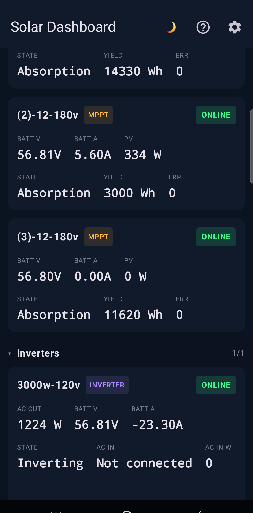

**Battery pack (BMS):** volts, amps, watts, a state-of-charge bar, capacity in
amp-hours, cell count, cycles, charge/discharge FET status, firmware, and per-NTC
temperatures. Faults and cell balancing are highlighted when present. An offline
pack shows why, for example a connection timeout.

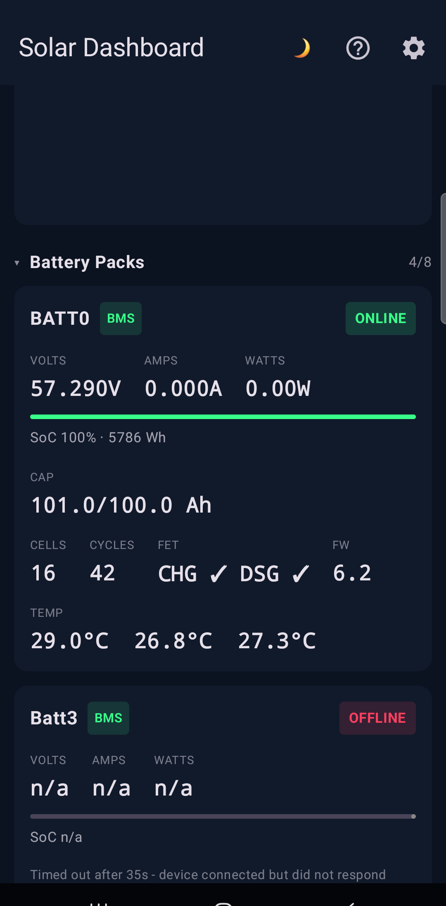

## 8. History charts

Scroll to the bottom of the dashboard for historical trend charts: battery
voltage, battery current, PV power, and state of charge. Each device is a colored
series with a legend, so you can compare packs and chargers over time. The number
of points kept is set in Settings.

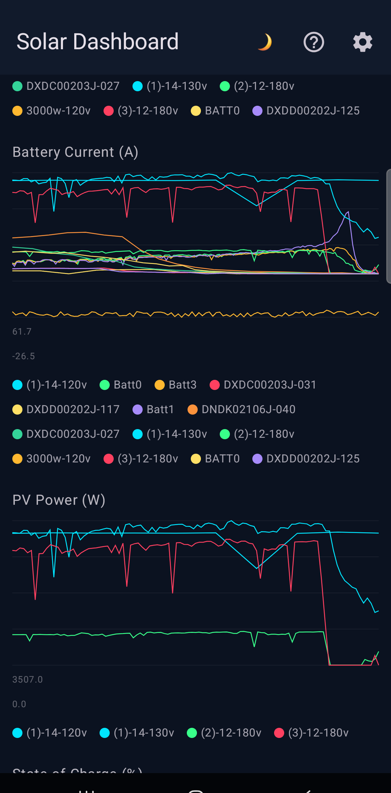

## 9. Settings

Open Settings with the gear icon. Tap any section header to expand or collapse it.

**Devices** (see [section 4](#4-adding-your-devices)) manages your device list.

**Polling & History** controls how the app reads and stores data:

- **BMS interval**: how often battery packs are read over a direct connection
  (minimum 30 seconds).
- **Victron interval**: how often Victron advertisements are scanned (minimum 10
  seconds).
- **Scan window**: how long each Victron scan runs.
- **Chart history points**: how many points each chart keeps in memory.
- **History retention (days)**: how long readings are kept in the database. Use 0
  to keep them forever.
- **Electricity rate (cents/kWh)**: your utility rate, used to price the
  "$ Saved" estimate. Defaults to the national average.
- **Persist history to database**: turn saving on or off.

Tap **Save settings** to apply.

## 10. Low-battery alerts

The **Low-Battery Alerts** section notifies you when the **average** battery
state of charge drops below a threshold you set. An alert is sent once when the
battery crosses below the threshold, then again only after it recovers a few
percent above, so you are not messaged repeatedly.

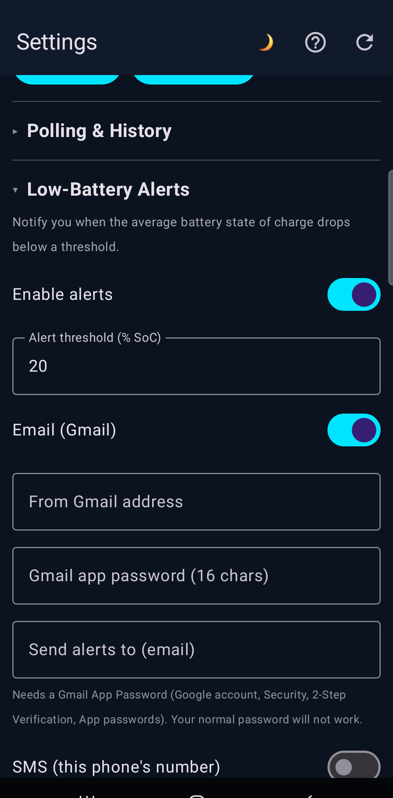

Turn on **Enable alerts**, set the **threshold**, then enable any combination of
three channels:

- **Email (Gmail).** Enter your Gmail address, a Gmail **App Password**, and the
  recipient address. The App Password is required because Google no longer allows
  normal passwords for this. Create one in your Google account under Security,
  2-Step Verification (turn it on if needed), then App passwords, and paste the
  16-character password in.
- **SMS (this phone's number).** Sends a text from this phone's own SIM to a
  number you enter. Requires the SMS permission (requested when you enable it) and
  cell service. Standard message rates apply.
- **Phone notification.** Shows a notification on this phone. No setup needed.

While alerts are on you are also notified for other conditions, each sending once
and clearing on recovery:

- **All battery packs unreachable at once**, so you know when the monitor has
  lost sight of your batteries entirely, not only when they read low.
- **High temperature**: any sensor at or above the threshold you set (set the
  threshold to 0 to turn this off).
- **Device fault**: any device reporting a protection fault (over-voltage,
  over-current, short circuit, over-temperature, and similar).

Use **Send test alert** to send a test over every enabled channel and confirm your
setup before you rely on it. The on-screen result reports each channel as `sent`
or shows the exact error.

Alert settings, including the Gmail App Password, are stored encrypted on the
phone and are only ever sent to Gmail's mail server.

## 11. Database maintenance

The **Database Maintenance** section shows how many readings are stored and the
date range they span. You can delete a date range (enter a `From` and/or `To`
date, leaving a bound blank for open-ended) or clear all history.

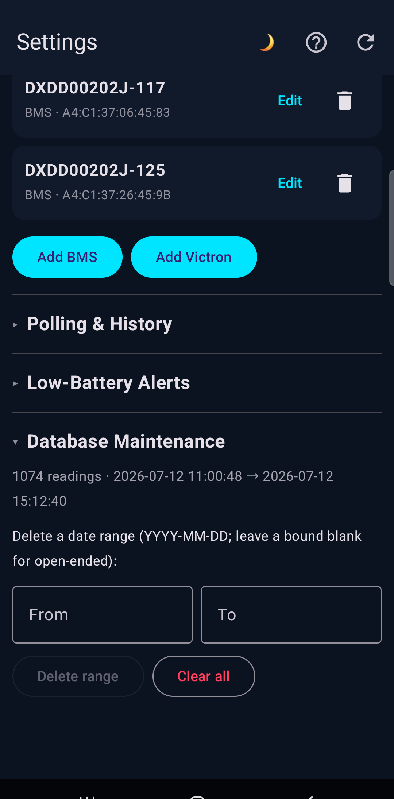

Deletion is permanent and requires unlocking with your fingerprint, face, or PIN
first.

## 12. Help screen

The question-mark icon in the top bar opens an in-app version of this guide,
covering setup, the advertisement key, the Energy card, alerts, and
troubleshooting.

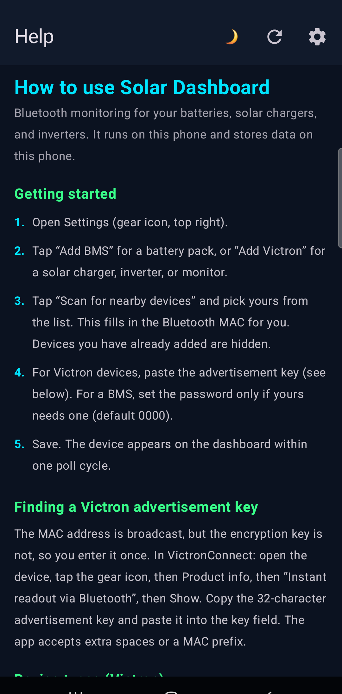

## 13. Troubleshooting

**A device shows OFFLINE or "Device not seen during scan".**

- Confirm Bluetooth is on and you granted the Bluetooth permissions.
- Open the device editor and run **Scan for nearby devices** again to confirm the
  device is in range and the MAC matches.
- For Victron, confirm the advertisement key is the one from VictronConnect
  (Instant readout), not the Encryption key.
- Give it a poll cycle or two. The interval is set in Settings.
- Close VictronConnect if it is open, so it does not hold the connection.

**A BMS reads OFFLINE with a timeout.** The pack connected but did not answer in
time. This is usually transient; it clears on a later cycle. If a pack needs a
password, set it in the device editor.

**$ Saved seems low.** It reflects only the energy your loads have used since
midnight, priced at an average rate. It climbs through the day and resets at
midnight.

**Alerts did not arrive.** Use **Send test alert** and read the per-channel
result. For email, the most common cause is using a normal Google password
instead of an App Password, or not having 2-Step Verification enabled.

**Monitoring stops when the screen is off, or the "Updated" time is stale.**
Grant the battery-optimization exemption (tap the "Battery optimization is on"
banner on the dashboard). Keep a dedicated monitoring phone plugged in. You can
confirm polling is alive at a glance: the "Updated HH:MM:SS" line at the top of
the dashboard should be within one poll interval of the current time.

## 14. Privacy and data

The app runs entirely on your phone. Device readings and history are stored in a
local database on the device. The only outbound network traffic is the
low-battery alerts you configure: email goes to Gmail's SMTP server, SMS goes
through your carrier. Alert credentials are stored encrypted using the Android
Keystore.
